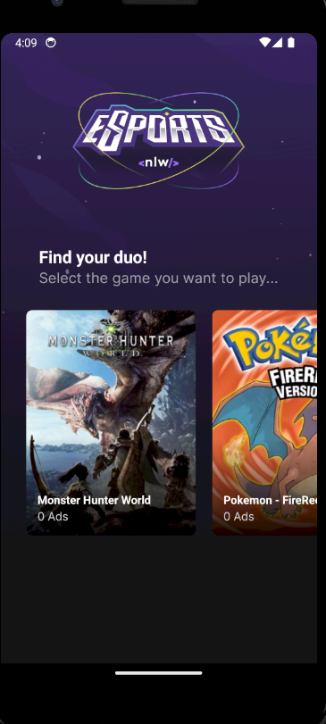

<h2 align='center'>:video_game: eSports :video_game:</h2>

## :pushpin: Requirements: :pushpin:

NodeJs: :link: https://nodejs.org/en/
 
Expo: :link: https://docs.expo.dev/
 
API: :link: https://github.com/Aleydon/eSports-backend.git

---

<h2 align="center">Home Page Screenshot</h2>

   
  
   
   
	

